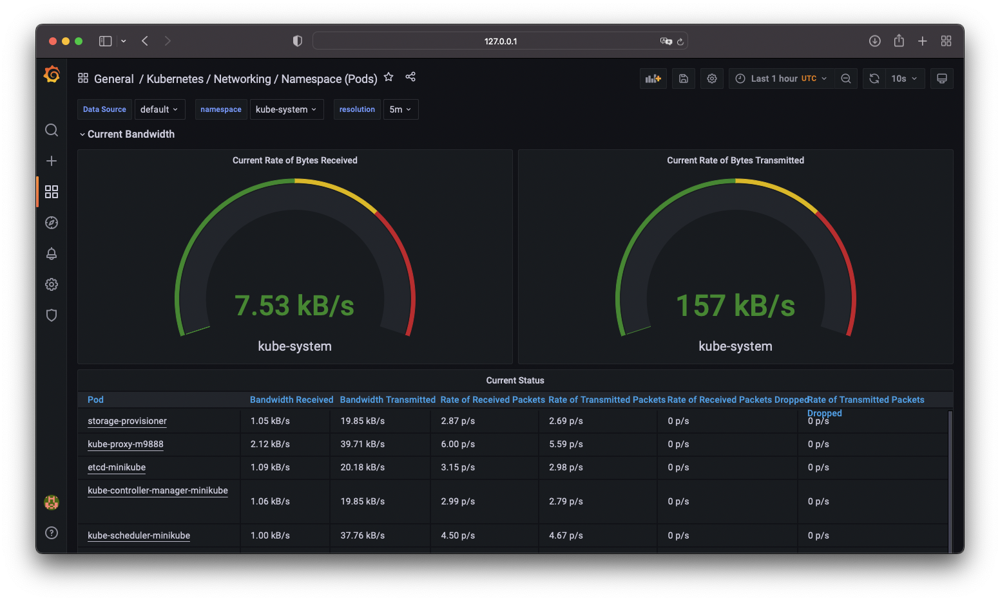

### Desafio PicPay - João Antônio

#### 1. Clone o repositório github.com/nopp/simpleapp-python:

- Crie uma imagem Docker da aplicação desse repositório:

 `docker image build -t jonnyff/simpleapp-python:1.0`

- Envie a imagem para o dockerhub:

 `docker push jonnyff/simpleapp-python:1.0`

#### 2. A partir da imagem criada, crie os seguintes yaml para subir a aplicação em Kubernetes:

- Deployment (simpleapp.yaml):

```yaml
apiVersion: apps/v1
kind: Deployment
metadata:
  name: simpleapp
  labels:
    app: simpleapp
spec:
  replicas: 1
  selector:
    matchLabels:
      app: simpleapp
  template:
    metadata:
      labels:
        app: simpleapp
    spec:
      containers:
        - name: simpleapp
          image: jonnyff/simpleapp-python:1.0
          imagePullPolicy: Always
          envFrom:
            - configMapRef:
                name: simpleapp-cm
          ports:
          - containerPort: 8008
      imagePullSecrets:
      - name: regcred
```

- Configmap (simpleapp-cm.yaml):

```yaml
apiVersion: v1
kind: ConfigMap
metadata:
  name: simpleapp-cm
data:
  Code: "PicPay2022"
```

- Utilizar o configmap(simpleapp-cm) como envFrom no deployment(simpleapp):

```yaml
          envFrom:
            - configMapRef:
                name: simpleapp-cm
```

#### 3. Suba um cluster kubernetes e faça o deploy dos yaml do item 2:

Para esse desafio eu subi um cluster no MiniKube:

   `minikube start --cpus 4 --memory 8192`

Criando o configmap:

   `kubectl apply -f simpleapp-cm.yaml`

Fazendo o deploy:

   `kubectl create -f simpleapp.yaml`

Para testar a aplicação no Kubernetes:

`kubectl port-forward simpleapp-747878fb64-6dqlm --namespace default 8007:8008`

#### 4. Configure uma monitoração nesse cluster(via helm) utilizando:

- Prometheus
- Grafana(crie um dashboard para demonstração)

Nessa caso eu usei um helm chart que sobe a stack completa de Prometheus e Grafana, segue:

- Adicionando repositório do Prometheus:

 `helm repo add prometheus-community https://prometheus-community.github.io/helm-charts`
 
- Atualizando repositório do helm:

 `helm repo update`

- Instalando a stack Prometheus/Grafana:

 `helm install prometheus prometheus-community/kube-prometheus-stack`
 
- Verificando se as aplicações subiram

Prometheus: `kubectl port-forward prometheus-prometheus-kube-prometheus-prometheus-0 --namespace default 9091:9090`

Grafana: `kubectl port-forward prometheus-grafana-64dd94bb65-b6dv6 --namespace default 3001:3000`


Dashboard de Exemplo:


